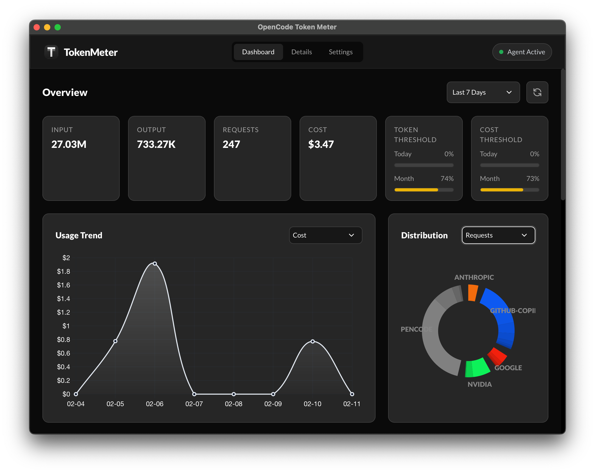

<h1 align="center">OpenCode Token Meter</h1>
<p align="center">
  <a href="https://github.com/CHW0n9/OpenCode-Token-Meter/releases">
    
  </a>
</p>

**OpenCode Token Meter** is a lightweight macOS/Windows menubar app built with Python and pywebview to monitor [OpenCode](https://opencode.ai) token usage, costs, and analytics.



**Note**: This project was developed entirely using [OpenCode](https://opencode.ai). This project is not built by the OpenCode team and is not affiliated with them in any way.

---

## 🚀 Features

- **📊 Real-time Token Tracking** - Monitors incoming and outgoing tokens from AI interactions.
- **💰 Cost Calculation** - Automatic cost computation based on model-specific pricing.
- **📈 Detailed Analytics** - View token usage by provider, model, and time range with bold, high-contrast charts.
- **⚙️ Customizable Settings** - Set cost thresholds and notification preferences.
- **📥 Token Usage Export** - Export usage data for custom date ranges to CSV or Clipboard.
- **🔄 Unified Architecture** - Background agent and stats worker run as embedded threads within a single process.
- **🔐 Privacy-Focused** - All data stored locally in a SQLite database with robust deduplication.
- **💻 Cross-Platform** - Native experience for both macOS (Menubar) and Windows (System Tray).

---

## 📦 Installation

### Option 1: Pre-built Binaries (Recommended)

#### Windows

1. Download `OpenCodeTokenMeter-1.0.1.exe` from [GitHub Releases](https://github.com/chw0n9/opencode-token-meter/releases). (Newer version under testing).
2. Run the executable to start the application. The app will appear in your system tray.

#### macOS

1. Download `OpenCodeTokenMeter-1.1.0.dmg` from [GitHub Releases](https://github.com/chw0n9/opencode-token-meter/releases).
2. Drag "OpenCode Token Meter.app" to your Applications folder.
3. **Security Note**: Since the app is unsigned, you may need to go to **System Settings → Privacy & Security** and click **"Open Anyway"** on first launch.

---

### Option 2: Build from Source

#### Dependencies

- Python 3.9+

```bash
# Windows
pip install pyinstaller pywebview pystray pillow pyperclip win10toast

# macOS
pip install pyinstaller pywebview rumps pillow pyperclip pyobjc-framework-Cocoa
```

#### Build Commands

This project uses a **single unified spec file** (`OpenCodeTokenMeter.spec`) with automatic platform detection.

**Windows:**

```powershell
.\build_windows.bat
```

Output: `dist\OpenCodeTokenMeter.exe` (Single unified executable)

**macOS:**

```bash
./build.sh
```

Output: `dist/OpenCode Token Meter.app` (Native app bundle)

---

## 🏗️ Project Architecture

### Directory Structure

```
opencode-token-meter/
│
├─ 📄 Root Documentation
│  ├── LICENSE                  # GPL-3.0 License
│  ├── README.md                # Unified Documentation
│  ├── CHANGELOG.md             # Version History
│  └── AGENTS.md                # Developer Guide
│
├─ 🔨 Build System
│  ├── OpenCodeTokenMeter.spec   # Unified PyInstaller configuration
│  ├── build.sh                 # macOS build script
│  └── build_windows.bat        # Windows build script
│
└─ 📁 App/                      # Source Code
   ├─ 🔧 agent/                 # Message tracking & DB logic
   └─ 🖥️ webview_ui/            # Web-based Frontend (pywebview)
      ├── backend/              # Python-JS API Bridge
      └── web/                  # HTML/CSS/JS (Tailwind, Chart.js)
```

### Data Flow

1. **Agent**: Monitors the OpenCode message directory (`~/.local/share/opencode/storage/message/`).
2. **Database**: Parses JSON messages and stores deduplicated token counts in a local SQLite database (`index.db`).
3. **Bridge**: The `JsApi` bridge fetches data from the database and provides it to the webview UI.
4. **UI**: Displays statistics and charts using a responsive, dark-themed interface with bold **Lato (900)** typography.

---

## ⚙️ Configuration

- **Database Location**:
  - macOS: `~/Library/Application Support/OpenCode Token Meter/index.db`
  - Windows: `%APPDATA%\OpenCode Token Meter\index.db`
- **Model Pricing**: Override default pricing in **Settings → Cost Meter**. Custom models are labeled as **(customized)** in the UI.

---

## 🤝 Contributing

See [AGENTS.md](AGENTS.md) for full developer guidelines, including:

- Running in development mode (`python App/webview_ui/main_tray.py --debug`).
- Formatting (PEP 8, Black).
- SQL safety (parameterized queries).
- Manual verification checklist.

---

## 📜 License

This project is licensed under the GNU General Public License v3.0 - see the [LICENSE](LICENSE) file for details.

---

## Credits

- Developed entirely with [OpenCode](https://opencode.ai) - an AI-powered terminal interface for coding.
- This project uses the [Lato](https://fonts.google.com/specimen/Lato) typeface, designed by Łukasz Dziedzic and licensed under the SIL Open Font License.
