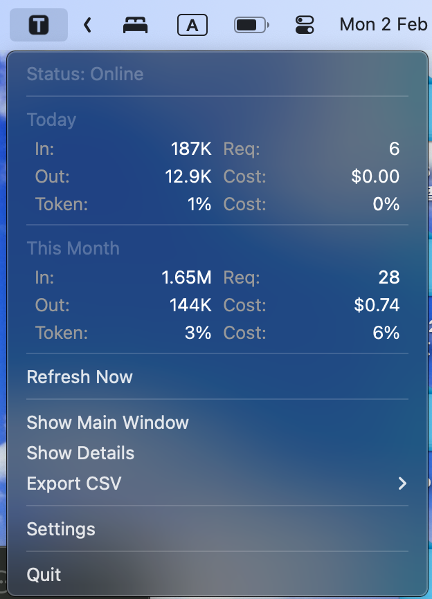
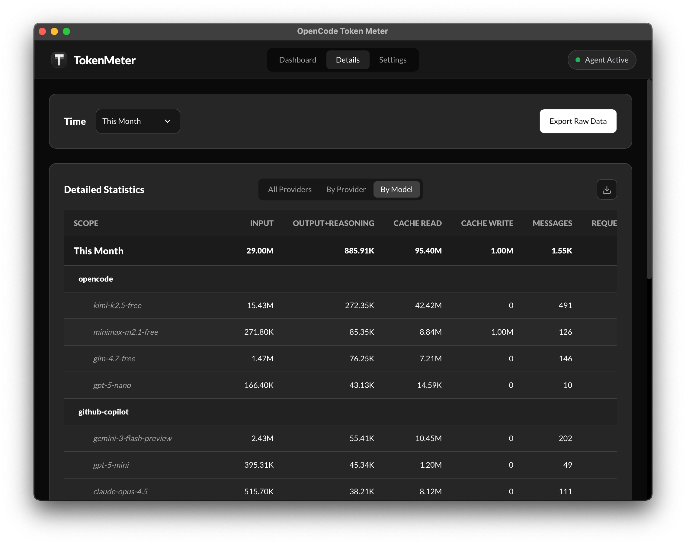
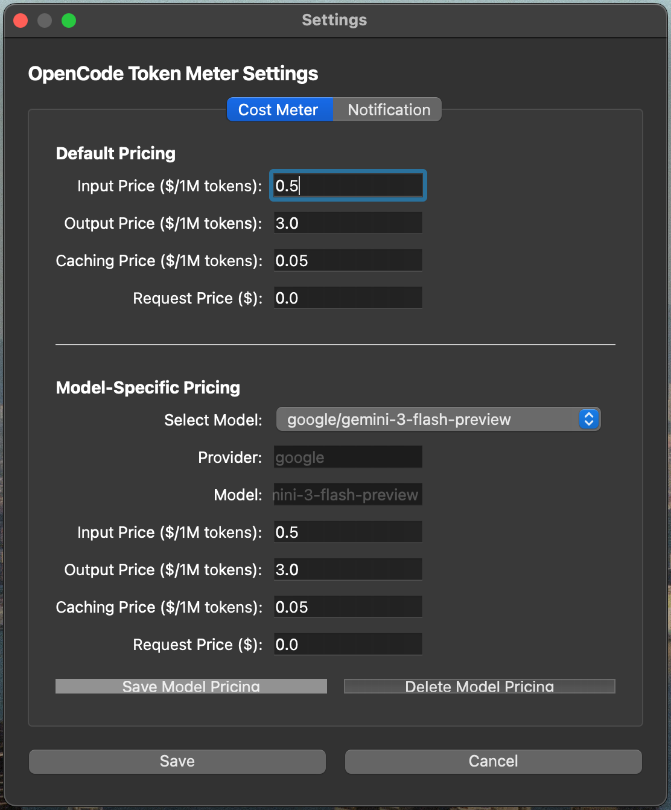

<h1 align="center">OpenCode Token Meter</h1>
<p align="center">
  <a href="https://github.com/CHW0n9/OpenCode-Token-Meter/releases">
    
  </a>
</p>

**OpenCode Token Meter** is a lightweight macOS menubar application that tracks model token usage from [OpenCode](https://opencode.ai). It monitors message history, calculates costs for different AI models, and provides detailed usage statistics with an intuitive interface.

**Note**: This project was developed entirely using [OpenCode](https://opencode.ai). This project is not built by the OpenCode team and is not affiliated with them in any way.

---

## Features

- **📊 Real-time Token Tracking** - Monitors incoming and outgoing tokens from AI interactions
- **💰 Cost Calculation** - Automatic cost computation based on model-specific pricing
- **📈 Detailed Analytics** - View token usage by provider, model, and time range
- **⚙️ Customizable Settings** - Set cost thresholds and notification preferences
- **📥 Token Usage Export** - Export usage data for custom date ranges
- **🔄 Automatic Updates** - Background agent continuously monitors your message directory
- **🔐 Privacy-Focused** - All data stored locally in SQLite database
- **⚡ Lightweight** - Minimal resource usage in menubar

---

## Installation

### Option 1: DMG Installer (Recommended)

1. Download `OpenCodeTokenMeter-1.0.0.dmg` from the [GitHub Releases](https://github.com/chw0n9/opencode-token-meter/releases)
2. Double-click the `.dmg` file to open it
3. Drag "OpenCode Token Meter.app" to the Applications folder
4. Open Applications folder and double-click "OpenCode Token Meter.app"

#### Important: Running Unsigned Apps on macOS

Since the app is not code-signed, you may see a security warning on first launch:

**If you see "cannot be opened because it is from an unidentified developer":**

1. Go to System Settings → Privacy & Security
2. Scroll down to "OpenCode Token Meter.app"
3. Click "Open Anyway" next to the app name
4. Re-launch the application

Alternatively, run in Terminal:
```bash
xattr -d com.apple.quarantine "/Applications/OpenCode Token Meter.app"
```

### Option 2: Build from Source

**Requirements:**
- Python 3.12+
- PyQt6
- SQLite3

**Steps:**

```bash
# Clone repository
git clone https://github.com/chw0n9/opencode-token-meter.git
cd opencode-token-meter

# Build the app
./build.sh

# The DMG file will be generated in the build/ directory
```

---

## Token Data Location

This app scans your OpenCode message directory to calculate token usage. Messages are read from:

```
~/.local/share/opencode/storage/message/
```

Each OpenCode session creates a subdirectory like `ses_XXXXXXX/` containing JSON message files with token count data.

The app stores its configuration and calculated metrics locally at:

```
~/Library/Application Support/OpenCode Token Meter/index.db
```

---

## Project Architecture

```
OpenCode Token Meter
│
├── App/
│   ├── agent/                    # Background service (Python)
│   │   ├── agent/__main__.py    # Entry point
│   │   ├── agent/db.py          # SQLite database with dedup logic
│   │   ├── agent/scanner.py     # Message directory scanner
│   │   ├── agent/uds_server.py  # Unix Domain Socket server
│   │   ├── agent/config.py      # Configuration paths
│   │   └── pyproject.toml
│   │
│   └── menubar/                  # PyQt6 GUI application
│       ├── menubar/__main__.py  # Entry point
│       ├── menubar/app.py       # Main app logic, dialogs, UI
│       ├── menubar/settings.py  # Settings management
│       ├── menubar/uds_client.py # Socket client
│       ├── menubar/resources/   # App icons and resources
│       ├── setup.py
│       └── pyproject.toml
│
├── build.sh                      # Build script (PyInstaller)
└── AGENTS.md                     # Developer guide
```

### Key Components

**Agent (Background Service)**
- Runs continuously in background via Unix Domain Socket
- Scans `~/.local/share/opencode/storage/message/` directory
- Parses JSON message files and extracts token counts
- Deduplicates messages (handles OpenCode's session copying)
- Stores data in local SQLite database

**Menubar App (GUI)**
- Shows token usage and cost stats in macOS menubar
- Displays in-context tokens, requests, output tokens, and calculated costs
- Main window with detailed statistics breakdown
- Settings dialog for cost configuration and thresholds
- Custom date range export functionality
- Async loading with spinner for long operations

**Deduplication System**
- Prevents double-counting when OpenCode copies messages between sessions
- Groups messages by: timestamp, role, input, output, reasoning, cache info, provider, model
- Selects canonical record using lexicographically smallest `msg_id`
- All aggregates and exports use deduplicated data

---

## Usage

### Starting the App

1. Launch "OpenCode Token Meter" from Applications folder
2. App icon appears in macOS menubar (top right)
3. Agent service automatically starts in background
4. Token data syncs every few seconds

### Menubar Display

The menubar shows up to 6 metrics in a 2×3 grid:

**Row 1:**
- **In** - Total input tokens
- **Req** - Total requests

**Row 2:**
- **Out** - Total output tokens
- **Cost** - Calculated cost in USD

**Row 3 (Optional):**
- **Token%** - Current input token % of threshold
- **Cost%** - Current cost % of threshold

Row 3 only displays if token/cost thresholds are enabled in Settings.

### Main Window

Click the menubar icon to open the main window with:
- Detailed statistics
- Breakdown by provider and model
- All/Provider/Model view tabs
- Date range selector for export

### Settings

**Cost Meter Tab:**
- Select from preset models (Google, etc.)
- Or select "Custom model" to enter provider/model name manually
- View and adjust pricing for each model

**Notification Tab:**
- Enable/disable token usage alerts
- Set token threshold and cost threshold
- Optional: customize notification frequency

### Exporting Data

1. Click "Custom Range" in details dialog
2. Select start and end dates
3. View statistics for that period
4. Export to clipboard or file

---

## Configuration

### Model Pricing

The app includes default pricing for popular providers:
- **Google**: Gemini 3 models
- **OpenCode Zen**: GLM 4.7
- **Github Copilot**: Claude Sonnet 4.5, GPT 5.2 Codex (Charged by premium requests)
- **Other**: Any custom provider/model

You can add custom models in Settings → Cost Meter → "Custom model"

### Database

The SQLite database is created automatically at:
```
~/Library/Application Support/OpenCode Token Meter/index.db
```

It contains:
- Messages table with token counts and metadata
- Dedup index for fast queries
- View tracking and session information

---

## Troubleshooting

### Agent Not Starting

If the agent fails to start:

1. Check if message directory exists:
   ```bash
   ls -la ~/.local/share/opencode/storage/message/
   ```

2. Verify socket path is writable:
   ```bash
   ls -la ~/Library/Application\ Support/OpenCode\ Token\ Meter/
   ```

3. Check system logs:
   ```bash
   log stream --predicate 'process == "opencode-agent"'
   ```

### No Token Data Showing

1. Ensure OpenCode messages exist:
   ```bash
   ls ~/.local/share/opencode/storage/message/*/
   ```

2. Check database:
   ```bash
   sqlite3 ~/Library/Application\ Support/OpenCode\ Token\ Meter/index.db "SELECT COUNT(*) FROM messages;"
   ```

3. Restart the app (quit and relaunch)

### App Crashes

Please report issues with:
- macOS version
- App version number
- Steps to reproduce
- System logs

---

## Development

### Quick Setup

```bash
# Clone and navigate
git clone https://github.com/chw0n9/opencode-token-meter.git
cd opencode-token-meter

# Read developer guide
cat AGENTS.md
```

### Running in Development

```bash
# Terminal 1: Run agent
cd App/agent
python3 -m agent

# Terminal 2: Run menubar app
cd App/menubar
python3 -m menubar
```

### Building for Distribution

```bash
./build.sh
# DMG will be at: build/OpenCodeTokenMeter-1.0.0.dmg
```

### Code Style

- Python 3.12+
- Follow PEP 8 with Black (88 char line width)
- Use isort for import organization
- Type hints for public APIs
- Parameterized SQL queries only

See [AGENTS.md](AGENTS.md) for complete developer guidelines.

---

## Database Safety

- All SQL queries use parameterized placeholders (`?`) to prevent injection
- SQLite with WAL mode for safe concurrent access
- Deduplication query prevents double-counting messages
- All data stored locally (no network transmission)

---

## License

This project is licensed under the GNU General Public License v3.0 - see the [LICENSE](LICENSE) file for details.

---

## Credits

Developed entirely with [OpenCode](https://opencode.ai) - an AI-powered terminal interface for coding.

[OpenCode Repository](https://github.com/anomalyco/opencode)

---

## Screenshots

- Menubar display with token metrics



- Main window with detailed statistics
  


- Settings dialog with model selection



---

## Support & Feedback

- Report bugs: [GitHub Issues](https://github.com/chw0n9/opencode-token-meter/issues)
- Feature requests: [GitHub Discussions](https://github.com/chw0n9/opencode-token-meter/discussions)

---

## Changelog

See [CHANGELOG.md](CHANGELOG.md) for version history and updates.
