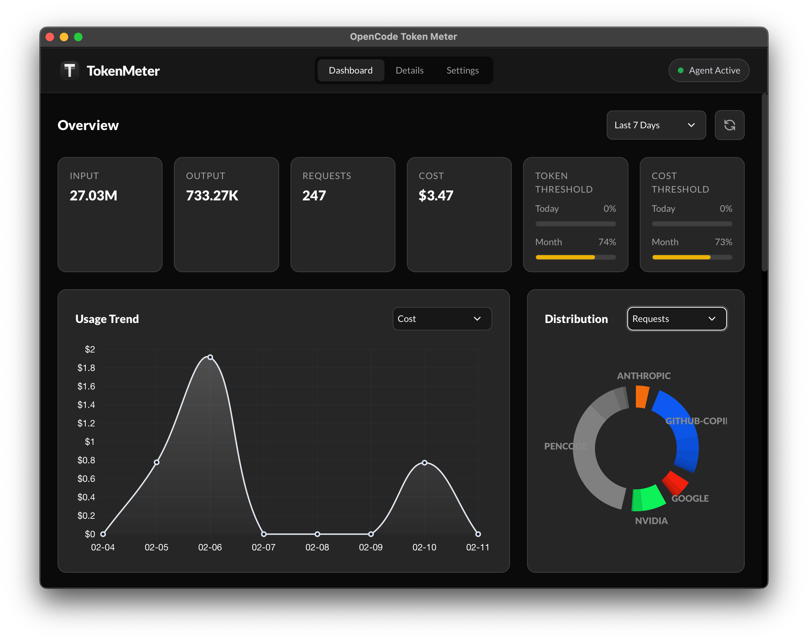

<h1 align="center">OpenCode Token Meter</h1>
<p align="center">
  <a href="https://github.com/CHW0n9/OpenCode-Token-Meter/releases">
    
  </a>
</p>

**OpenCode Token Meter** is a lightweight macOS/Windows menubar app built with Python and pywebview to monitor [OpenCode](https://opencode.ai) token usage, costs, and analytics.



**Note**: This project was developed entirely using [OpenCode](https://opencode.ai). This project is not built by the OpenCode team and is not affiliated with them in any way.

---

## 🚀 Features

- **📊 Real-time Token Tracking** - Monitors token usage from AI interactions by scanning both local message files and the new `opencode.db`.
- **💰 Cost Calculation** - Automatic cost computation based on model-specific pricing (Anthropic, Google, GitHub Copilot, NVIDIA, etc.).
- **📈 Detailed Analytics** - View token usage by provider, model, and time range with bold, high-contrast charts (Chart.js).
- **⚙️ Customizable Settings** - Set cost thresholds, manage custom model pricing, and configure notification preferences.
- **📥 Data Export** - Export usage data for custom date ranges to CSV or Clipboard.
- **🔄 Modern Architecture** - Background agent and stats worker run as embedded threads within a single process.
- **🔐 Privacy-Focused** - All data stored locally in a SQLite database with robust deduplication logic.
- **💻 Cross-Platform** - Native experience for both macOS (Menubar) and Windows (System Tray).

---

## 📦 Installation

### Option 1: Pre-built Binaries (Recommended)

#### Windows
1. Download `OpenCodeTokenMeter-1.1.1.exe` from [GitHub Releases](https://github.com/chw0n9/opencode-token-meter/releases).
2. Run the executable to start the application. The app will appear in your system tray.

#### macOS
1. Download `OpenCodeTokenMeter-1.1.1.dmg` from [GitHub Releases](https://github.com/chw0n9/opencode-token-meter/releases).
2. Drag "OpenCode Token Meter.app" to your Applications folder.
3. **Security Note**: Since the app is unsigned, you may need to go to **System Settings → Privacy & Security** and click **"Open Anyway"** on first launch.

---

### Option 2: Build from Source

#### Dependencies
- Python 3.9+
- Recommended: Conda environment `opencode`.

```bash
# Windows
pip install pyinstaller pywebview pystray pillow pyperclip win10toast

# macOS
pip install pyinstaller pywebview rumps pillow pyperclip pyobjc-framework-Cocoa
```

#### Build Commands
This project uses a **single unified spec file** (`OpenCodeTokenMeter.spec`) with automatic platform detection.

**Windows:**
```powershell
.\build_windows.bat
```
Output: `dist\OpenCodeTokenMeter.exe`

**macOS:**
```bash
./build.sh
```
Output: `dist/OpenCode Token Meter.app` and `.dmg`

---

## 🏗️ Project Architecture

### Directory Structure
```
opencode-token-meter/
├── 📄 Root Documentation
│   ├── LICENSE                  # GPL-3.0 License
│   ├── README.md                # English Documentation
│   ├── README_CN.md             # Chinese Documentation
│   ├── CHANGELOG.md             # Version History
│   └── AGENTS.md                # Developer Guide
├── 🔨 Build System
│   ├── OpenCodeTokenMeter.spec   # Unified PyInstaller configuration
│   ├── build.sh                 # macOS build script
│   └── build_windows.bat        # Windows build script
└── 📁 App/                      # Source Code
    ├── agent/                   # Message tracking & DB logic (Agent, Stats Worker)
    └── webview_ui/              # Web-based Frontend (pywebview)
        ├── backend/             # Python-JS API Bridge & Settings
        └── web/                 # HTML/CSS/JS (Tailwind, Chart.js, Lato font)
```

### Data Flow
1. **Scanner**: Periodically checks `~/.local/share/opencode/storage/message/` (legacy) and `opencode.db` (new) for AI messages.
2. **Database**: Parses JSON data and stores deduplicated records in a local SQLite database (`index.db`).
3. **Bridge**: The `JsApi` bridge fetches data from `index.db` and provides it to the webview UI.
4. **UI**: Displays statistics and charts using a responsive interface with bold **Lato (900)** typography.

---

## ⚙️ Configuration

- **Database Location**:
  - macOS: `~/Library/Application Support/OpenCode Token Meter/index.db`
  - Windows: `%APPDATA%\OpenCode Token Meter\index.db`
- **Model Pricing**: Override default pricing in **Settings → Cost Meter**. Supports input, output, caching, and per-request pricing.

---

## 🤝 Contributing

See [AGENTS.md](AGENTS.md) for full developer guidelines, including:
- Running in development mode (`python App/webview_ui/main_tray.py --debug`).
- SQL safety (always use parameterized queries).
- Manual verification checklist before release.

---

## 📜 License

This project is licensed under the GNU General Public License v3.0 - see the [LICENSE](LICENSE) file for details.

---

## Credits

- Developed entirely with [OpenCode](https://opencode.ai) - an AI-powered terminal interface for coding.
- This project uses the [Lato](https://fonts.google.com/specimen/Lato) typeface, designed by Łukasz Dziedzic and licensed under the SIL Open Font License.
